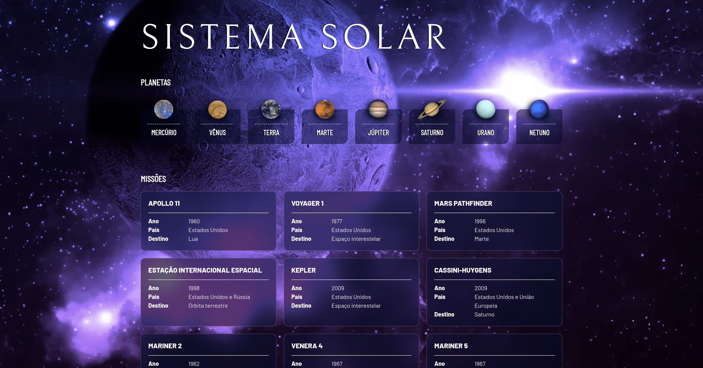

# Solar System

Esta aplicação React, desenvolvida com componentes de classe, lista todos os planetas do Sistema Solar e também algumas das missões espaciais mais conhecidas. Nela exercitei o uso de props e composição de componentes, conceitos fundamentais no desenvolvimento de aplicações React.

O design dessa aplicação foi desenvolvido utilizando o conceito de Mobile First.

Para a criação do Background em vídeo usei a biblioteca ReactPlayer.

## 🤹 Habilidades

  * Uso do JSX no React

  * Uso do método `render()` para renderizar mues componentes

  * Uso do `import` para trazer componentes em diferentes arquivos

  * Criação de componentes de classe em React

  * Criação de múltiplos componentes a partir de um array

  * Uso de `props` corretamente

  * Uso de `PropTypes` para validar as `props de um componente`

## 🚀 Tecnologias

- React é uma biblioteca JavaScript de código aberto focada na criação de interfaces de usuário em páginas da web.

- JavaScript é uma linguagem de programação interpretada estruturada, de script em alto nível com tipagem dinâmica fraca e multiparadigma.

- HTML é a linguagem base para se desenvolver qualquer site. 

- CSS é uma linguagem de folha de estilo composta por “camadas”, criado com o propósito de estilizar as páginas HTML.

<!-- ## Para rodar o projeto localmente. -->

<strong>🚀 Para rodar o projeto localmente</strong>
 
1. Clone o repositório
  * `git clone git@github.com:severidade/solar_system.git`.
  * Entre na pasta do repositório que você acabou de clonar:
    * `cd solar_system`

2. Instale as dependências e inicialize o projeto
  * Instale as dependências:
    * `npm install`
  * Inicialize o projeto:
    * `npm start` (uma nova página deve abrir no seu navegador com um texto simples)

  
<strong>🗣 Feedbacks</strong>
 
  
_Me dê feedbacks, estou aberto a novas ideias_ 😉

